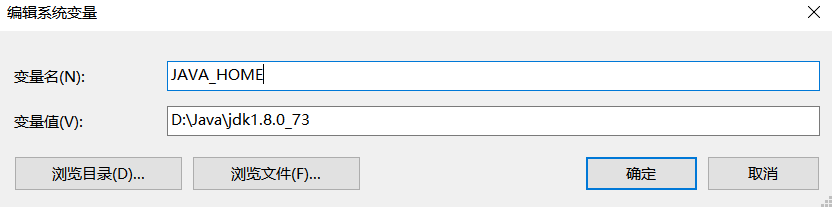
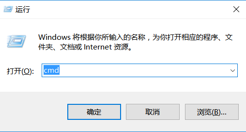
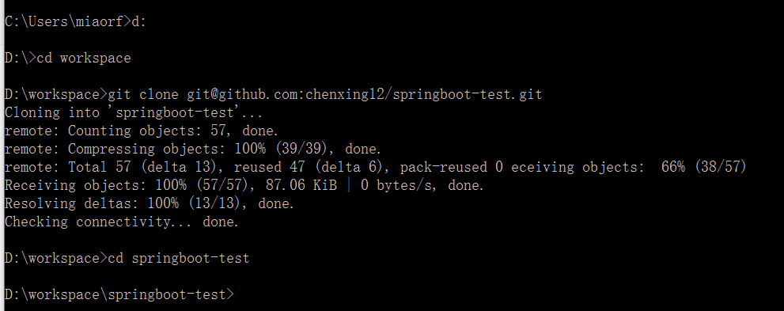

# springboot-test

## configure
* java 1.8+
* maven 3.3+
* spring-boot 1.3.5
* idea 15
* Thymeleaf 3

## how to run
1. [install java 1.8](#java)
2. [install maven](#maven)
2. [clone code and run](#run)


## <a name="java"/>install java 1.8
1. download from https://yunpan.cn/cR2GuInzbzWfh （提取码：a6c7）
2. double-click and install to your windows and make sure the install path contains no Chinese
3. find the install path, it may like
>     D:\Java\jdk1.8.0_73
4. add to System environment 添加到环境变量。
>    右键我的电脑-》属性-》高级系统设置-》环境变量-》新建 JAVA_HOME:D:\Java\jdk1.8.0_73

>    将%JAVA_HOME%/bin;追加到path环境变量。若path变量结尾没有分号，则先添加分号，注意是英文的分号

5. 测试是否安装成功。
```
   打开命令提示符（开始》运行》cmd 或win+r 输入cmd）输入java -version 和javac -version。如果显示如下则安装成功

     C:\Users\miaorf>java -version
     java version "1.8.0_77"
     Java(TM) SE Runtime Environment (build 1.8.0_77-b03)
     Java HotSpot(TM) 64-Bit Server VM (build 25.77-b03, mixed mode)
     C:\Users\miaorf>javac -version
     javac 1.8.0_73
```
## <a name="maven"/>install maven
1. 下载压缩包   https://yunpan.cn/cR2DrHF3UZAzg （提取码：a38a）并解压到合适的目录，比如解压后为：D:\Java\apache-maven-3.3.9
2. 添加到环境变量,像java一样 ：  新建 MAVEN_HOME:D:\Java\apache-maven-3.3.9，追加到path:%MAVEN_HOME%\bin
3. 测试是否安装成功
```
    在cmd中输入：
 C:\Users\miaorf>mvn -version
Apache Maven 3.3.9 (bb52d8502b132ec0a5a3f4c09453c07478323dc5; 2015-11-11T00:41:47+08:00)
Maven home: D:\Java\apache-maven-3.3.9\bin\..
Java version: 1.8.0_73, vendor: Oracle Corporation
Java home: D:\Java\jdk1.8.0_73\jre
Default locale: zh_CN, platform encoding: GBK
OS name: "windows 10", version: "10.0", arch: "amd64", family: "dos"
```

## <a name="run"/>clone code and run
在d盘创建一个你放代码的地方，比如：d:/workspace.cmd进入d盘并clone：
```
 git clone git@github.com:chenxing12/springboot-test.git


```

## Teach ajax by springboot
